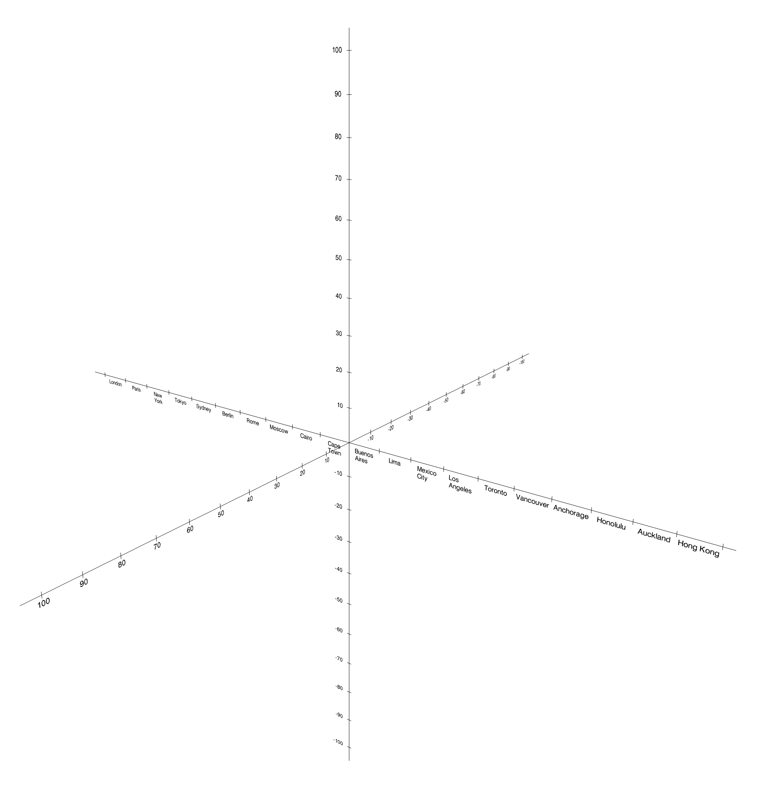
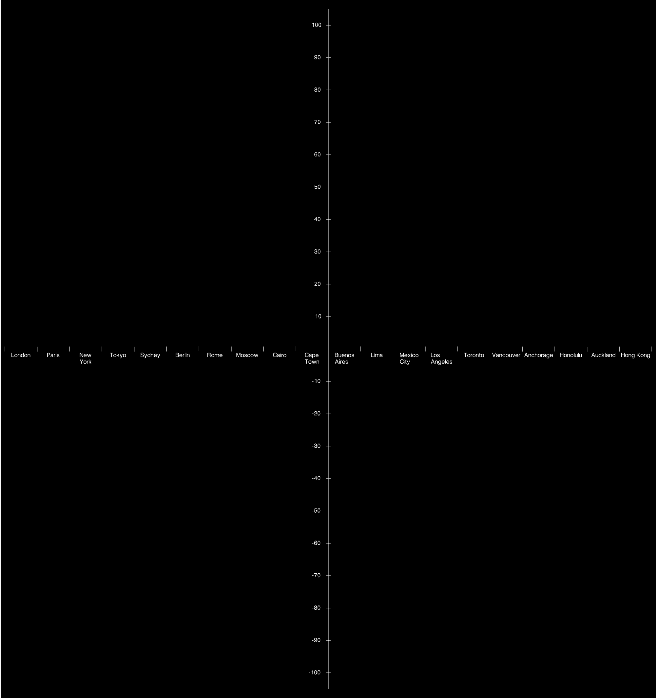
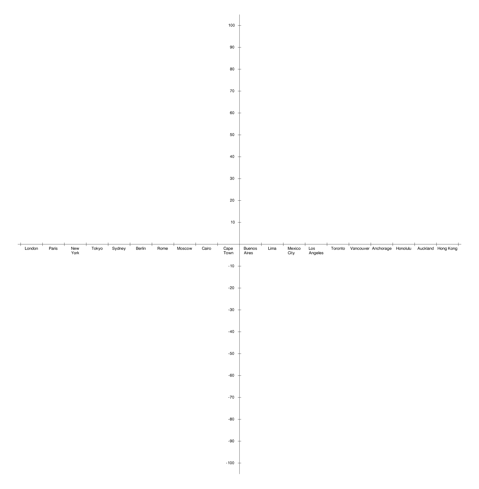

# WebGraphs
### Beautiful 2D & 3D graphs for the Web

## Color Schema
- WebGraphs support dark and light mode; you can still force specify using
 ```
 Settings.MODE = 'light';
 Settings.MODE = 'dark';
 ```

## 3D Coordinate System



## 2D Coordinate System

